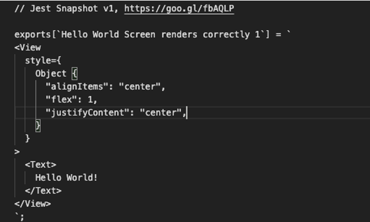
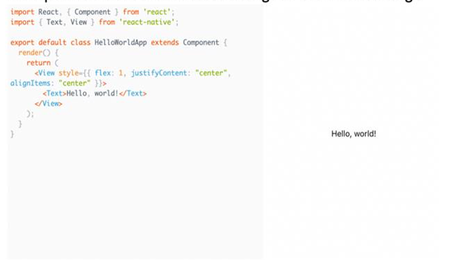
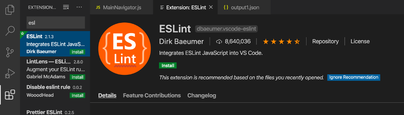

# Mobile Intern Test Driven Development Tutorial
This tutorial was created to introduce incoming mobile interns to react-native development

## Getting Started

### Installing
* Install XCode -- Install from macOS App Store (optional for testing on iPhone)
* [Android Studio](https://developer.android.com/studio/)
* [Node.js v8.x](https://nodejs.org/dist/latest-v8.x/)
* NPM v6.4.1 (After installing Node.js v8.x run this command `npm install --global npm@6.4.1`)
* [Homebrew](https://brew.sh/)
* CocoaPods (Don't install with Homebrew use `sudo gem install cocoapods -v 1.6.1`)
* Watchman (After installing Homebrew run brew install watchman)
* [Reactotron](https://github.com/infinitered/reactotron/releases) (optional for debugging)
* A text editor/IDE of your choice
    * We use [Visual Studio Code](https://code.visualstudio.com/)
* ES Lint (optional. This is what we use to standardize the format of our code)
    * if you are using VSCode follow the steps in the tips section to install
### Setup
* Clone the Repo
    ```
    git clone https://github.com/QueenOfInterns/Test-Driven-Development-Project-Mobile.git
    ```
* Run these commands
    ```
    npm install
    npm run pods
    ```
* (If console shows xcrun: error: SDK "iphoneos" cannot be located, try `sudo xcode-select --switch /Applications/Xcode.app` and then run `npm run pods` again.)
* To build on simulator
    ```
    npm run ios (to run iphone)
    npm run android (to run android)
    ```
* (If console shows Could not find iPhone X simulator or similar, follow #1 answer [here](https://stackoverflow.com/questions/54504076/react-native-run-ios-returns-error-could-not-find-iphone-x-simulator).)

## Tutorial
### Overview
* You can check if your tests pass anytime by using `npm run test`
   * This will output which tests pass, which tests fail and why for the whole app
   * If you would like to only run a test for one screen, use `npm run test Screen#` where # is the number of the screen you would like to check (there should be no space between Screen and the number)
* To check your code and unlock the next tab run npm `run checkTest #` where # is the screen you would like to check (there must be a space between checkTest and the number)
   * For example: `npm run checkTest 1` will check screen 1 and unlock screen 2 if all of screen 1’s tests pass
   * This will not output the results of the tests

### Screen1

* Welcome to the first screen of the Test Driven Development App! The purpose of this first screen is to get you acquainted with the format of our app and getting started with unit testing. 
* The first test is testing a simple “Hello World” Text tag within a View element. To do this, the test uses Snapshot testing. Here is a link that can help you get familiar with Snapshot testing: https://jestjs.io/docs/en/snapshot-testing.
    * Here is the path of the Snapshot tests:  /Test-Driven-Development-Project-Mobile/src/screens/Screen1/\_\_snapshots\_\_
        * Within the src/screens/ folder, each screen has its own folder that contains each Screen and its respective test. E.g. Screen1 contains Screen1.js and Screen1.test.js.
    * __Snapshot testing__: an easy way to check on changes in a component's output. The test renders a given component when it is first run and stores the output in a file. This output gets committed next to the code. Each time the test is run after that, the component is rendered again and the new output is compared with the version that we had previously stored.
    * __Describe statements__ and __it statements__ are used as headings to describe different sections that are being tested. __Describe__ breaks your test into sections and describes what is being tested. __It__ is used to describe what this specific section of the code is being tested for. In our Hello World test example, the __describe__ lets the programmer know that the “Hello World Screen” is being tested and the __it__ is describing what we are testing for: that the screen ‘renders correctly’. 



* The image above is an example of a Snapshot that is generated from the Hello World test on the first screen. Using this Snapshot, we are able to figure out what code would we need to implement that would make our Hello World test pass. Snapshots are used to test components, so we know that we need to implement our Hello World code in a component.
    * The Snapshot shows a View tag that contains a Text tag with the string “Hello World!” in it. It also contains styling which is included in the View tag. 
        * With this information, we can see that the code that we need to develop needs to be a component that has a Text tag within a View tag, like the code below.


### Screen2:

* Now that you’re more familiar with how the Test Driven Development App works, we can move onto more complicated test cases. For Screen2, we will be working with a __FlatList__ component test.
* As you can see from the screenshot above, this test has multiple Describe and It statements that can give us a clue to what the code actually looks like.
   * From the second describe statement, we can tell that the unit test is testing a FlatList component, so we know we will need to implement one. You can find more information on how to implement a FlatList component here: https://reactnative.dev/docs/flatlist
* From the first it statement, we see that the FlatList component needs to render some given data that is passed through the __props__ parameter. This means that the FlatList component will be using state to pass data from the __data prop__ to the FlatList. We can also see that there is a prop called ‘error’ that keeps track of whether or not the FlatList is reading data correctly. This case is a __“positive case”__ meaning that we are testing to see if our component does what we want it to do. 
   * The link above also has information about props and how to pass data in a FlatList.
   * Here is a link that will help you get a better understanding of what state is and how to you use it: https://reactnative.dev/docs/state#__docusaurus
* The second it statement is a __“negative case”__, meaning we are testing whether the component does what we don’t want it to do. In this case, we are testing to see if the app crashes when it doesn’t receive any data from the __data prop__.
* In the final it statement, we are testing to see if our component displays an error message when there is an error. This means that we are testing whether or not our __error prop__ works correctly.
* All of these tests use Snapshot testing (like in Screen1)
   * You can find the snapshots here : /Test-Driven-Development-Project-Mobile/src/screens/Screen2/__snapshots__/Screen2.test.js.snap
#### Helpful Steps:
1. Make a state called “users” and pass in an array of these objects:
   ```
   {name: 'Spongebob', phoneNumber: '479-387-5534'},
   {name: 'Patrick', phoneNumber: '479-256-5344'},
   {name: 'Sandy', phoneNumber: '367-899-7070'},
   {name: 'Squidward', phoneNumber: '367-345-9999'},
   {name: 'Mr. Krabs', phoneNumber: '504-214-3322'},
   {name: 'Gary', phoneNumber: '601-405-9977'},

   ```
2. Add an “error” state and assign it to false initially
3. After you read about Flatlist, use the FlatList properties to display the data. You assign values to properties like this `prop={object}`
   * A flatlist should have a key extractor, this gives each item an identifier. Your key extractor should look like this `keyExtractor={item => item.id}`
   *	The data property of the flatlist should be what you put as users in your state. You can access state by `this.state.users`
   *	Finally, the renderItem prop item is passed the object that will be rendered with each item in the data. Set this equal to `this.renderInfo`. We will create the object in the renderInfo function
4.	Go to the renderInfo function and display the item’s name and phone number in text fields
5. Once you are done, make sure to check if the tests pass!


## Tips
* To install ES Lint in VSCode:

    * Open VSCode, go to the bottom icon (the four squares) in the menu on the top left. Search ESLint in the search box and click on ESLint. Click the green install button. You may have to enable it after it installs if it does not automatically enable.
* [Integrated terminal in VSCode](https://code.visualstudio.com/docs/editor/integrated-terminal)
    * This can be used so you don’t have to have another window open to run the npm commands
* You can use `npm i` instead of `npm install`

## Common Pitfalls
* Whenever you make a big change (like adding packages) or the build seems to be failing for no reason (specifically with the error “react native version mismatch), close the terminal with the bundler and run
    ```
    npm i
    npm run pods
    npm run ios (or npm run android)
    ```
* If your npm commands are failing and you don’t know why. Try removing package-lock.json (rm package-lock.json) then run
    ```
    npm i
    npm run pods
    ```
